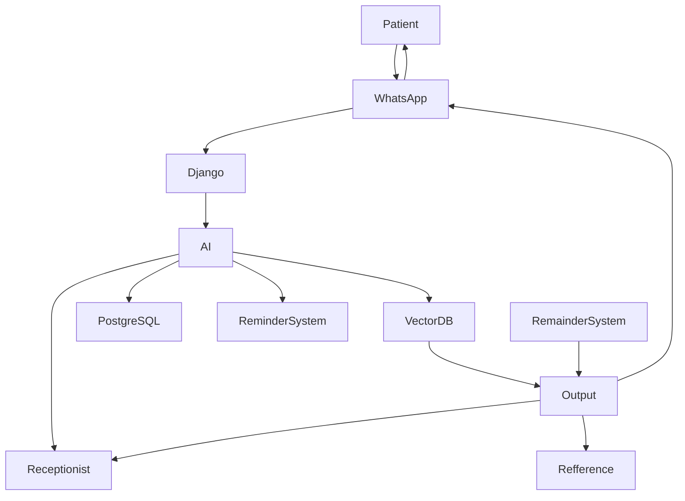

AI-Agent, connected to "Whatsapp" and meta. 
Requirements:
1. Missed Call:
	1. Follow up on missed call, notification to the receptionist. 
	2. Stating the time and requirement to initate call back
	3. Sending AI based chatbot acess to the patient to record their greiviances
2. Call Attended but no booking:
	1. Send remainders to confirm the booking they want. And advertisement of benefits and multiple available health plans to the patient.
	2. Send information to receptionist, to make the patients book appointment
3. Call Attended and Booked:
	1. Send confirmation to the receptionist and basic booking details. 
	2. Send information and detailed follow up to the patient, and remarks as well as future test report appointments and other details.

Other Requirements:
1. Robust integration with meta and whatsapp api as well as security monitoring mechanism. 
2. AI agent workflow in whatsapp and online monitoring of it.

Skeletal Implementation

### 1. WhatsApp Business Integration

- Receive patient messages
- Send messages automatically
- Appointment confirmations
- Reminders
- Follow-ups
### 2. RAG (Retrieval Augmented Generation)

The AI should answer questions like:

- Doctor timings
- Available departments
- Insurance accepted
- Hospital policies
- Medicine instructions
- Reports
- FAQs

Documents are stored in a vector database.

### 3. Agentic AI

Agent:

- Checks doctor availability
- Finds free slots
- Books slot
- Sends confirmation
- Updates receptionist
- Finds appointment
- Cancels it
- Updates calendar
- Sends confirmation

### 4. Automated Remainder
- Appointment reminder
- Medicine reminder
- Lab report reminder
- Vaccination reminder

Django backend + Celery

Documental Analogy - 

Mac Droid - Django Webhooks + call detection API 
Make.com -> cannot handle complex workflows
Solution custom buit AI agent and meta api integrtion, while backend hosted in different server

Multiple API calls, implement rate limiter and Groq API test integration. 

| Tasks                                         | Time Frame |
| --------------------------------------------- | ---------- |
| Backend AI MCP + RAG deployment               | 6-7 days   |
| Connection with Meta API and Chatbot Services | 8-9 days   |
| Implementation of vector DB storage           | 5-6 days   |
| Meta API integration and Missed call Webhooks | 10-12 days |
| Bug Fixes and Other optimizations             | NA         |
Major Challenges:

1. LLM Deployment and request handling.
2. Missed Call identification and query resolving. 
3. Overall Project Scalability and Monitoring.
4. Distributed architecture and code complexity.

